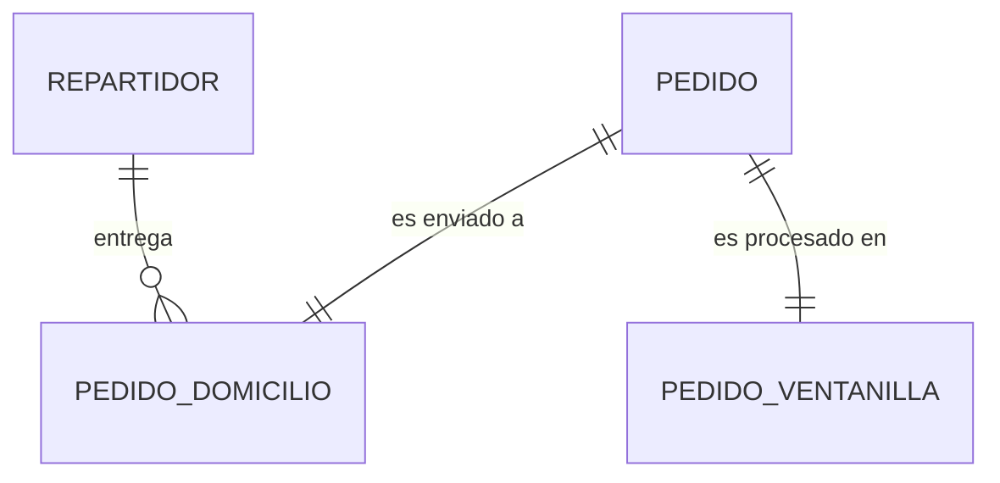

# Proyecto MkDocs - Mc Ilerna Albor Croft

## Información del Alumno
- **Nombre:** Alejandro García Ripalda
- **Módulo:** Administración de Sistemas Gestores de Bases de Datos
- **Ciclo:** ASIR - Albor Croft
- **Fecha de Entrega:** 16 de enero de 2026

---

## 📌 Enlaces de Entrega

### Repositorio GitHub
🔗 **https://github.com/AGarciaRipalda/proyecto-mc-ilerna**

### Sitio Web GitHub Pages
🌐 **https://AGarciaRipalda.github.io/proyecto-mc-ilerna/**

---

## 📖 Tema de la Documentación

Documentación técnica completa del proyecto de base de datos para el restaurante de comida rápida **"Mc Ilerna Albor Croft"**, ubicado en Jerez de la Frontera. 

El proyecto abarca desde el análisis de requisitos hasta la implementación SQL, incluyendo:
- Diseño Entidad-Relación
- Normalización hasta 3FN
- Modelo relacional completo
- Scripts SQL de implementación
- Seguridad y cumplimiento RGPD
- Pruebas y validaciones

---

## 📚 Estructura del Sitio (8 páginas)

### 1. Inicio (`index.md`)
- Presentación del proyecto
- Contextualización empresarial
- Datos del establecimiento Mc Ilerna Albor Croft

### 2. Requerimientos (`requerimientos.md`)
- Actas de reuniones con el cliente
- Definición de alcance operativo
- Estructura de productos y menús

### 3. Análisis (`analisis.md`)
- **Requisitos funcionales** (RF-01 a RF-06)
- **Requisitos no funcionales** (RNF-01 a RNF-04)
- **Proceso de normalización** (1FN, 2FN, 3FN)
- Decisiones de diseño justificadas

### 4. Diseño ER (`diseno-er.md`)
- Modelo Entidad-Relación completo
- Diagrama Mermaid con todas las entidades
- Atributos y relaciones principales

### 5. Diseño Lógico (`diseno-logico.md`)
- **Diccionario de datos completo** (9 tablas)
- Modelo relacional detallado
- Restricciones de integridad
- Diagramas de dependencias

### 6. Script SQL (`implementacion/script-sql.md`)
- Código DDL completo
- Creación de base de datos
- Definición de tablas con restricciones
- Índices de optimización

### 7. Pruebas (`implementacion/pruebas.md`)
- Datos de prueba (repartidores, productos, menús)
- Casos de uso simulados
- Validaciones de integridad
- Consultas estadísticas

### 8. Seguridad (`seguridad.md`)
- Estrategia de backups (completos e incrementales)
- Cumplimiento RGPD
- Gestión de usuarios y permisos
- Optimización y rendimiento

---

## 🛠️ Extensiones y Bloques Incluidos

### Extensiones de MkDocs Configuradas

```yaml
markdown_extensions:
  - pymdownx.highlight:
      anchor_linenums: true
  - pymdownx.inlinehilite
  - pymdownx.snippets
  - pymdownx.superfences:
      custom_fences:
        - name: mermaid
          class: mermaid
          format: !!python/name:mermaid2.fence_mermaid
  - tables
```

**Descripción de extensiones:**

- **`pymdownx.highlight`** - Resaltado de sintaxis con numeración de líneas en bloques de código
- **`pymdownx.inlinehilite`** - Permite código inline con resaltado de sintaxis
- **`pymdownx.snippets`** - Inclusión de fragmentos de código externos
- **`pymdownx.superfences`** - Bloques de código anidados y soporte para diagramas Mermaid
- **`tables`** - Tablas Markdown con formato avanzado y alineación personalizada

### Plugins Utilizados

```yaml
plugins:
  - search
  - mermaid2
```

**Descripción de plugins:**

- **`search`** - Buscador integrado en español para toda la documentación
- **`mermaid2`** - Renderizado de diagramas técnicos (ER, flujo, grafos de dependencias)

### Bloques Desplegables (Admonitions)

Uso extensivo de admonitions para destacar información importante:

```markdown
!!! info "Datos del Proyecto"
    Información contextual del proyecto

!!! warning "Restricción"
    Advertencias sobre limitaciones técnicas

!!! note "Comentarios"
    Notas técnicas adicionales
```

**Ejemplos en el proyecto:**
- `index.md`: Bloque info con datos del establecimiento
- `analisis.md`: Definiciones de formas normales
- `seguridad.md`: Artículos del RGPD

---

## 📝 Elementos de Markdown Utilizados

### ✅ Títulos y Subtítulos
- Uso de H1 (`#`) a H6 (`######`)
- Jerarquía clara en todas las páginas
- Ejemplo: Estructura de `analisis.md` con 6 niveles jerárquicos

### ✅ Listas
- **Listas ordenadas:** Pasos de procedimientos y casos de uso
- **Listas no ordenadas:** Características y requisitos
- **Listas anidadas:** Estructura de decisiones de diseño

### ✅ Enlaces
- Enlaces internos entre páginas de documentación
- Enlaces a secciones específicas dentro de páginas
- Ejemplo: Referencia de `script-sql.md` a `pruebas.md`

### ✅ Imágenes
- Diagramas técnicos integrados
- Formato: ``

### ✅ Bloques de Código
Más de **40 bloques de código** en múltiples lenguajes:

- **SQL:** Scripts DDL, consultas SELECT, validaciones
- **Bash:** Scripts de backup y restauración
- **Python:** Pseudocódigo de integración con IA
- **YAML:** Configuración de MkDocs

**Ejemplo:**
```sql
CREATE TABLE REPARTIDOR (
    Num_Repartidor INT AUTO_INCREMENT,
    Nombre VARCHAR(50) NOT NULL,
    DNI VARCHAR(9) NOT NULL,
    CONSTRAINT PK_Repartidor PRIMARY KEY (Num_Repartidor),
    CONSTRAINT UK_Repartidor_DNI UNIQUE (DNI)
) ENGINE=InnoDB;
```

### ✅ Tablas
Más de **25 tablas** en todo el proyecto:

- Tablas con alineación personalizada (`:---`, `:---:`, `---:`)
- Tablas complejas de diccionario de datos
- Tablas de comparación y estadísticas

**Ejemplo:**
```markdown
| Columna | Tipo | Restricciones | Descripción |
|:--------|:-----|:--------------|:------------|
| `Num_Repartidor` | INT | **PK**, AUTO_INCREMENT | Identificador único |
```

### ✅ Diagramas Mermaid
**5 diagramas técnicos profesionales:**

1. **Diagrama ER completo** (`diseno-er.md`) - 118 líneas
2. **Diagrama de categorías de tablas** (`diseno-logico.md`)
3. **Diagrama de especialización** (`diseno-logico.md`)
4. **Diagrama de dependencias** (`diseno-logico.md`)
5. **Grafo de flujo de normalización** (`analisis.md`)

**Ejemplo:**


---

## 🎨 Personalización del Tema

### Configuración del Tema Material

```yaml
theme:
  name: material
  language: es
  palette:
    - scheme: default
      primary: red
      accent: red
    - scheme: slate
      primary: red
      accent: red
  features:
    - navigation.tabs
    - navigation.sections
    - content.code.copy
```

**Características implementadas:**

- **Idioma español:** Interfaz completamente en español
- **Paleta personalizada:** Colores corporativos (rojo) para identidad visual
- **Modo claro/oscuro:** Alternancia automática según preferencias del usuario
- **Navegación por pestañas:** Mejor organización de secciones principales
- **Secciones expandibles:** Navegación jerárquica intuitiva
- **Botón copiar código:** Mejora la experiencia de usuario

---

## 📊 Estadísticas del Proyecto

- **Total de páginas:** 8
- **Total de líneas de documentación:** ~1,800
- **Diagramas Mermaid:** 5
- **Tablas:** 25+
- **Bloques de código:** 40+
- **Lenguajes de código:** SQL, Bash, Python, YAML
- **Admonitions:** 10+
- **Commits en Git:** 1 (inicial completo)

---

## 🚀 Proceso de Desarrollo

### Fase 1: Análisis de Requisitos (2 días)
- Reuniones simuladas con cliente
- Definición de alcance operativo
- Identificación de entidades y relaciones

### Fase 2: Diseño Conceptual (1 día)
- Modelo Entidad-Relación
- Normalización hasta 3FN
- Diagramas Mermaid técnicos

### Fase 3: Diseño Lógico (1 día)
- Diccionario de datos completo
- Restricciones de integridad
- Modelo relacional detallado

### Fase 4: Implementación (2 días)
- Scripts SQL DDL completos
- Datos de prueba realistas
- Validaciones de integridad

### Fase 5: Documentación (2 días)
- Configuración de MkDocs
- Redacción de contenidos técnicos
- Personalización del tema Material

### Fase 6: Despliegue (1 día)
- Repositorio Git
- GitHub Pages
- Verificación final

---

## ✅ Verificación de Requisitos

### Requisitos Obligatorios
- ✅ Repositorio público en GitHub
- ✅ Mínimo 5 páginas (tengo 8)
- ✅ Tema configurado (Material)
- ✅ Navegación definida en `mkdocs.yml`
- ✅ Nombre del sitio y autor
- ✅ Títulos y subtítulos
- ✅ Listas (ordenadas y no ordenadas)
- ✅ Enlaces (internos y a secciones)
- ✅ Imágenes (diagramas técnicos)
- ✅ Bloques de código (SQL, Bash, Python, YAML)
- ✅ Bloques desplegables (admonitions)
- ✅ Despliegue en GitHub Pages
- ✅ Sitio accesible públicamente

### Extras Implementados (+1 punto)
- ✅ Extensiones de MkDocs (pymdownx)
- ✅ Buscador habilitado en español
- ✅ Iconos y admonitions con formato
- ✅ Tablas avanzadas con alineación
- ✅ Diagramas Mermaid profesionales
- ✅ Modo claro/oscuro
- ✅ Navegación por pestañas

---

## 🎯 Conclusión

Este proyecto representa una **documentación técnica completa y profesional** de un sistema de gestión de bases de datos para un restaurante de comida rápida. 

Se ha utilizado **MkDocs con el tema Material** para crear un sitio web estático moderno, accesible y fácil de navegar, cumpliendo con todos los requisitos de la rúbrica del profesor.

La documentación incluye desde el análisis de requisitos hasta la implementación SQL, pasando por el diseño ER y lógico, con especial atención a la **seguridad**, **cumplimiento RGPD** y **optimización del sistema**.

---

**Alumno:** Alejandro García Ripalda  
**Fecha:** 16 de enero de 2026  
**Módulo:** ASGBD - ASIR  
**Centro:** Albor Croft, Jerez de la Frontera

---

## 📞 Enlaces Importantes

- **Repositorio:** https://github.com/AGarciaRipalda/proyecto-mc-ilerna
- **Documentación:** https://AGarciaRipalda.github.io/proyecto-mc-ilerna/
- **Tema MkDocs:** https://squidfunk.github.io/mkdocs-material/
