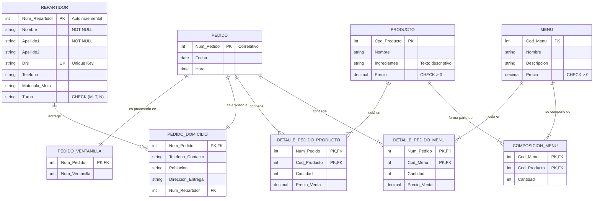

# Diseño Conceptual: El Modelo Entidad/Relación

El Modelo Entidad/Relación (E/R) constituye la abstracción de la realidad empresarial de **Mc Ilerna Albor Croft**. La elección de las entidades y sus interrelaciones busca minimizar la redundancia mientras se maximiza la expresividad de los datos.

## Entidades y Atributos Principales

Se han identificado entidades fuertes que sostienen la estructura y entidades de especialización que aportan el detalle operativo:

* **Pedido:** Núcleo del sistema. Posee una clave primaria `Num_Pedido` correlativa. Sus atributos incluyen Fecha y Hora.
* **Especializaciones de Pedido:**
    * **Pedido_Ventanilla:** Incluye el atributo `Num_Ventanilla`.
    * **Pedido_Domicilio:** Incluye `Telefono_Contacto`, `Poblacion` y `Direccion_Entrega`.
* **Repartidor:** Contiene `Num_Repartidor` (PK), Nombre, Apellidos, DNI, Teléfono, Matrícula de la moto y Turno (Mañana, Tarde, Noche).
* **Producto:** Catálogo individual con `Cod_Producto`, Nombre, Ingredientes y Precio.
* **Menú:** Entidad comercial con `Cod_Menu`, Nombre, Descripción y Precio.

A continuación se presenta el diseño conceptual del sistema

