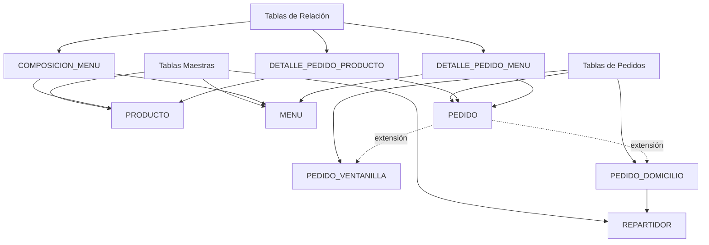
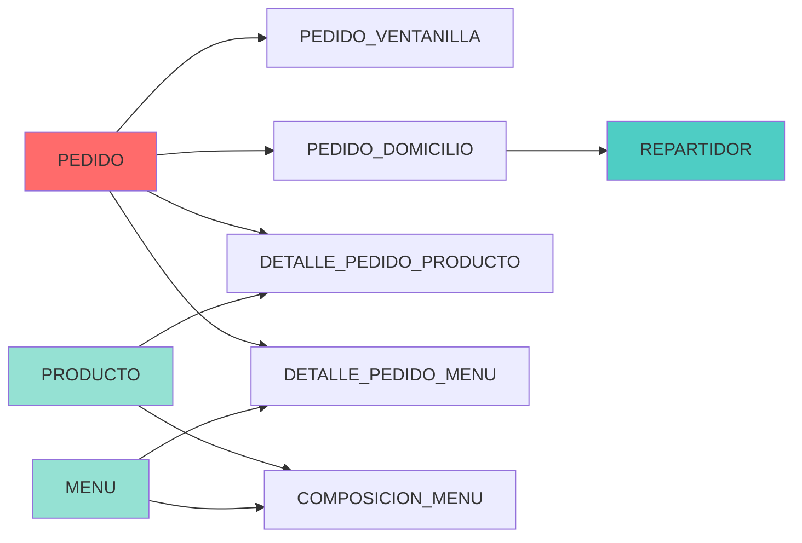

# Diseño Lógico y Modelo Relacional

El diseño lógico transforma el modelo conceptual E/R en un esquema relacional implementable en SQL. Este capítulo documenta el **diccionario de datos completo**, las **restricciones de integridad** y la **arquitectura de especialización** utilizada para los pedidos.

---

## Modelo Relacional Completo

### Esquema de Tablas

El sistema se compone de **9 tablas** organizadas en tres categorías:



---

## Diccionario de Datos

### Tabla: REPARTIDOR

**Descripción:** Almacena la información de los empleados repartidores que realizan entregas a domicilio.

| Columna | Tipo de Dato | Restricciones | Descripción |
|:--------|:-------------|:--------------|:------------|
| `Num_Repartidor` | INT | **PK**, AUTO_INCREMENT, NOT NULL | Identificador único del repartidor |
| `Nombre` | VARCHAR(50) | NOT NULL | Nombre del repartidor |
| `Apellido1` | VARCHAR(50) | NOT NULL | Primer apellido |
| `Apellido2` | VARCHAR(50) | NULL | Segundo apellido (opcional) |
| `DNI` | VARCHAR(9) | **UNIQUE**, NOT NULL | Documento de identidad (clave alternativa) |
| `Telefono` | VARCHAR(15) | NULL | Teléfono de contacto |
| `Matricula_Moto` | VARCHAR(10) | NULL | Matrícula del vehículo asignado |
| `Turno` | CHAR(1) | CHECK IN ('M','T','N'), NOT NULL | Turno: Mañana, Tarde, Noche |

**Claves:**
- **Primaria:** `Num_Repartidor`
- **Alternativa:** `DNI` (UNIQUE)

**Restricciones:**
- `CHECK (Turno IN ('M', 'T', 'N'))` - Solo permite valores válidos de turno

---

### Tabla: PRODUCTO

**Descripción:** Catálogo de productos individuales disponibles para la venta.

| Columna | Tipo de Dato | Restricciones | Descripción |
|:--------|:-------------|:--------------|:------------|
| `Cod_Producto` | INT | **PK**, AUTO_INCREMENT, NOT NULL | Código único del producto |
| `Nombre` | VARCHAR(100) | NOT NULL | Nombre comercial del producto |
| `Ingredientes` | TEXT | NULL | Descripción de ingredientes (gestión de alérgenos) |
| `Precio` | DECIMAL(6,2) | CHECK > 0, NOT NULL | Precio unitario actual |

**Claves:**
- **Primaria:** `Cod_Producto`

**Restricciones:**
- `CHECK (Precio > 0)` - El precio debe ser positivo

---

### Tabla: MENU

**Descripción:** Agrupaciones comerciales de productos con precio promocional.

| Columna | Tipo de Dato | Restricciones | Descripción |
|:--------|:-------------|:--------------|:------------|
| `Cod_Menu` | INT | **PK**, AUTO_INCREMENT, NOT NULL | Código único del menú |
| `Nombre` | VARCHAR(100) | NOT NULL | Nombre comercial del menú |
| `Descripcion` | TEXT | NULL | Descripción detallada de la oferta |
| `Precio` | DECIMAL(6,2) | CHECK > 0, NOT NULL | Precio del menú completo |

**Claves:**
- **Primaria:** `Cod_Menu`

**Restricciones:**
- `CHECK (Precio > 0)` - El precio debe ser positivo

---

### Tabla: PEDIDO

**Descripción:** Tabla base que registra todos los pedidos con numeración correlativa única.

| Columna | Tipo de Dato | Restricciones | Descripción |
|:--------|:-------------|:--------------|:------------|
| `Num_Pedido` | INT | **PK**, AUTO_INCREMENT, NOT NULL | Número correlativo único de pedido |
| `Fecha` | DATE | NOT NULL | Fecha del pedido |
| `Hora` | TIME | NOT NULL | Hora del pedido |

**Claves:**
- **Primaria:** `Num_Pedido`

**Notas:**
- Esta tabla es la **entidad base** de la jerarquía de especialización
- Cada registro debe tener exactamente una extensión (ventanilla o domicilio)

---

### Tabla: PEDIDO_VENTANILLA

**Descripción:** Extensión de PEDIDO para pedidos realizados en ventanilla.

| Columna | Tipo de Dato | Restricciones | Descripción |
|:--------|:-------------|:--------------|:------------|
| `Num_Pedido` | INT | **PK**, **FK** → PEDIDO, NOT NULL | Referencia al pedido base |
| `Num_Ventanilla` | INT | NOT NULL | Número de ventanilla donde se atendió |

**Claves:**
- **Primaria:** `Num_Pedido`
- **Foránea:** `Num_Pedido` → `PEDIDO(Num_Pedido)` ON DELETE CASCADE

**Cardinalidad:** 1:1 con PEDIDO (extensión)

---

### Tabla: PEDIDO_DOMICILIO

**Descripción:** Extensión de PEDIDO para pedidos con entrega a domicilio.

| Columna | Tipo de Dato | Restricciones | Descripción |
|:--------|:-------------|:--------------|:------------|
| `Num_Pedido` | INT | **PK**, **FK** → PEDIDO, NOT NULL | Referencia al pedido base |
| `Telefono_Contacto` | VARCHAR(15) | NOT NULL | Teléfono del cliente |
| `Poblacion` | VARCHAR(100) | NOT NULL | Población de entrega |
| `Direccion_Entrega` | VARCHAR(200) | NOT NULL | Dirección completa de entrega |
| `Num_Repartidor` | INT | **FK** → REPARTIDOR, NOT NULL | Repartidor asignado |

**Claves:**
- **Primaria:** `Num_Pedido`
- **Foráneas:** 
  - `Num_Pedido` → `PEDIDO(Num_Pedido)` ON DELETE CASCADE
  - `Num_Repartidor` → `REPARTIDOR(Num_Repartidor)`

**Cardinalidad:** 
- 1:1 con PEDIDO (extensión)
- N:1 con REPARTIDOR (un repartidor puede entregar múltiples pedidos)

---

### Tabla: COMPOSICION_MENU

**Descripción:** Tabla de relación N:M que define qué productos componen cada menú.

| Columna | Tipo de Dato | Restricciones | Descripción |
|:--------|:-------------|:--------------|:------------|
| `Cod_Menu` | INT | **PK**, **FK** → MENU, NOT NULL | Código del menú |
| `Cod_Producto` | INT | **PK**, **FK** → PRODUCTO, NOT NULL | Código del producto |
| `Cantidad` | INT | CHECK > 0, NOT NULL | Unidades del producto en el menú |

**Claves:**
- **Primaria:** (`Cod_Menu`, `Cod_Producto`)
- **Foráneas:**
  - `Cod_Menu` → `MENU(Cod_Menu)` ON DELETE CASCADE
  - `Cod_Producto` → `PRODUCTO(Cod_Producto)`

**Restricciones:**
- `CHECK (Cantidad > 0)` - La cantidad debe ser positiva

**Ejemplo:** El Menú Ahorro puede contener 1 Hamburguesa + 1 Bebida + 1 Patatas

---

### Tabla: DETALLE_PEDIDO_PRODUCTO

**Descripción:** Líneas de pedido para productos individuales (relación N:M entre PEDIDO y PRODUCTO).

| Columna | Tipo de Dato | Restricciones | Descripción |
|:--------|:-------------|:--------------|:------------|
| `Num_Pedido` | INT | **PK**, **FK** → PEDIDO, NOT NULL | Número de pedido |
| `Cod_Producto` | INT | **PK**, **FK** → PRODUCTO, NOT NULL | Código del producto |
| `Cantidad` | INT | CHECK > 0, NOT NULL | Unidades solicitadas |
| `Precio_Venta` | DECIMAL(6,2) | CHECK > 0, NOT NULL | Precio unitario en el momento de la venta |

**Claves:**
- **Primaria:** (`Num_Pedido`, `Cod_Producto`)
- **Foráneas:**
  - `Num_Pedido` → `PEDIDO(Num_Pedido)` ON DELETE CASCADE
  - `Cod_Producto` → `PRODUCTO(Cod_Producto)`

**Restricciones:**
- `CHECK (Cantidad > 0)`
- `CHECK (Precio_Venta > 0)`

**Nota:** `Precio_Venta` permite mantener histórico de precios y aplicar descuentos sin modificar el catálogo.

---

### Tabla: DETALLE_PEDIDO_MENU

**Descripción:** Líneas de pedido para menús (relación N:M entre PEDIDO y MENU).

| Columna | Tipo de Dato | Restricciones | Descripción |
|:--------|:-------------|:--------------|:------------|
| `Num_Pedido` | INT | **PK**, **FK** → PEDIDO, NOT NULL | Número de pedido |
| `Cod_Menu` | INT | **PK**, **FK** → MENU, NOT NULL | Código del menú |
| `Cantidad` | INT | CHECK > 0, NOT NULL | Unidades solicitadas |
| `Precio_Venta` | DECIMAL(6,2) | CHECK > 0, NOT NULL | Precio del menú en el momento de la venta |

**Claves:**
- **Primaria:** (`Num_Pedido`, `Cod_Menu`)
- **Foráneas:**
  - `Num_Pedido` → `PEDIDO(Num_Pedido)` ON DELETE CASCADE
  - `Cod_Menu` → `MENU(Cod_Menu)`

**Restricciones:**
- `CHECK (Cantidad > 0)`
- `CHECK (Precio_Venta > 0)`

---

## Arquitectura de Especialización: Extensiones de Tabla

### Concepto

La jerarquía de pedidos se implementa mediante el patrón **Table Extension** (Extensión de Tabla), donde:

1. **Tabla Base:** `PEDIDO` contiene atributos comunes a todos los pedidos
2. **Tablas de Extensión:** `PEDIDO_VENTANILLA` y `PEDIDO_DOMICILIO` contienen atributos específicos

### Características

```mermaid
erDiagram
    PEDIDO ||--|| PEDIDO_VENTANILLA : "extiende (1:1)"
    PEDIDO ||--|| PEDIDO_DOMICILIO : "extiende (1:1)"
    
    PEDIDO {
        int Num_Pedido PK
        date Fecha
        time Hora
    }
    
    PEDIDO_VENTANILLA {
        int Num_Pedido PK_FK
        int Num_Ventanilla
    }
    
    PEDIDO_DOMICILIO {
        int Num_Pedido PK_FK
        string Telefono_Contacto
        string Poblacion
        string Direccion_Entrega
        int Num_Repartidor FK
    }
```

**Ventajas:**
- ✅ **Integridad:** `ON DELETE CASCADE` garantiza que al eliminar un pedido base se eliminan sus extensiones
- ✅ **Eficiencia:** No hay campos NULL innecesarios
- ✅ **Escalabilidad:** Fácil agregar nuevos tipos de pedido (app móvil, tótem)
- ✅ **Consultas:** Se puede consultar `PEDIDO` para estadísticas generales o hacer JOIN para detalles específicos

**Consulta de ejemplo:**
```sql
-- Todos los pedidos con su tipo
SELECT p.Num_Pedido, p.Fecha, p.Hora,
       CASE 
           WHEN pv.Num_Pedido IS NOT NULL THEN 'Ventanilla'
           WHEN pd.Num_Pedido IS NOT NULL THEN 'Domicilio'
       END AS Tipo_Pedido
FROM PEDIDO p
LEFT JOIN PEDIDO_VENTANILLA pv ON p.Num_Pedido = pv.Num_Pedido
LEFT JOIN PEDIDO_DOMICILIO pd ON p.Num_Pedido = pd.Num_Pedido;
```

---

## Diagrama de Dependencias Completo



**Leyenda:**
- 🔴 Tabla base de jerarquía
- 🔵 Tablas maestras
- 🟢 Tablas de catálogo

---

## Restricciones de Integridad Resumen

### Integridad de Entidad
- Todas las tablas tienen **clave primaria** definida
- Uso de **AUTO_INCREMENT** para claves surrogadas
- **NOT NULL** en todas las claves primarias

### Integridad Referencial
- **9 relaciones de clave foránea** implementadas
- **ON DELETE CASCADE** en extensiones de pedido y tablas de detalle
- **ON DELETE RESTRICT** (por defecto) en referencias a catálogos

### Integridad de Dominio
- **CHECK (Precio > 0)** en productos y menús
- **CHECK (Cantidad > 0)** en todas las tablas de detalle
- **CHECK (Turno IN ('M','T','N'))** en repartidores
- **UNIQUE (DNI)** en repartidores

### Integridad Semántica
- Un pedido debe ser **exactamente** de ventanilla **o** de domicilio (no ambos, no ninguno)
- Esta restricción se implementa a nivel de aplicación o mediante triggers

---

## Configuración Técnica

### Motor de Almacenamiento
```sql
ENGINE = InnoDB
```
**Justificación:** Soporte completo para transacciones ACID y claves foráneas.

### Conjunto de Caracteres
```sql
DEFAULT CHARSET = utf8mb4 COLLATE = utf8mb4_unicode_ci
```
**Justificación:** Soporte completo para caracteres Unicode (incluyendo emojis) y ordenación correcta en español.

### Índices Recomendados

Además de los índices automáticos en claves primarias y foráneas:

```sql
-- Optimización para consultas por fecha
CREATE INDEX idx_pedido_fecha ON PEDIDO(Fecha);

-- Optimización para consultas por repartidor
CREATE INDEX idx_pedido_domicilio_repartidor ON PEDIDO_DOMICILIO(Num_Repartidor);

-- Optimización para búsqueda de productos
CREATE INDEX idx_producto_nombre ON PRODUCTO(Nombre);
```

---

## Conclusiones del Diseño Lógico

El modelo relacional resultante:

1. ✅ Cumple con la **Tercera Forma Normal (3FN)**
2. ✅ Implementa **9 tablas** con responsabilidades claras
3. ✅ Utiliza **extensiones de tabla** para jerarquía de pedidos
4. ✅ Garantiza **integridad referencial** completa
5. ✅ Permite **escalabilidad** para nuevos canales
6. ✅ Facilita **consultas estadísticas** y auditoría
7. ✅ Optimizado para **rendimiento** con InnoDB

El diseño está listo para su implementación en MySQL/MariaDB.
